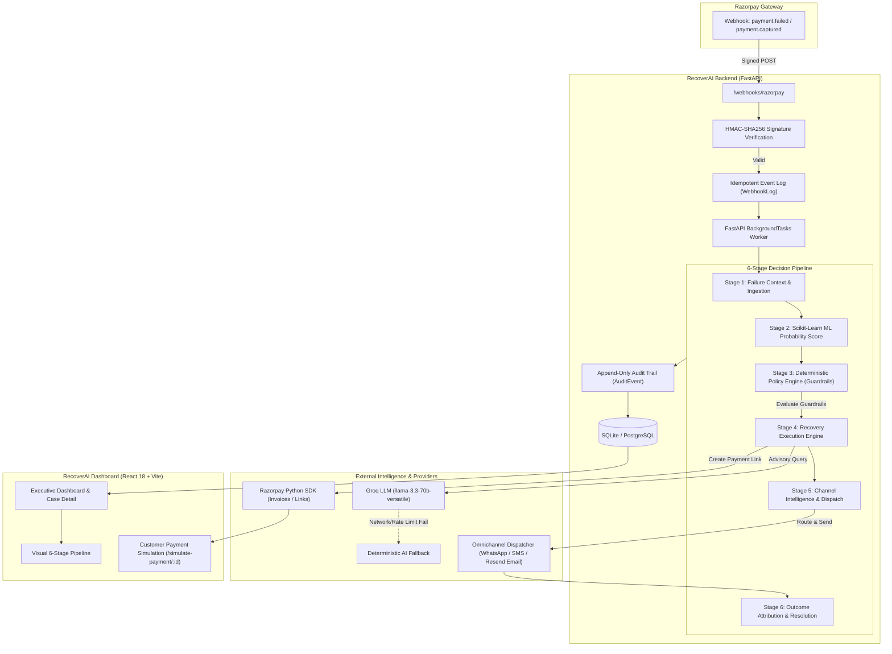

# Razorpay RecoverAI

[](https://python.org)
[](https://fastapi.tiangolo.com)
[](https://react.dev)
[](https://www.typescriptlang.org)
[](https://scikit-learn.org)
[](https://groq.com)
[](https://razorpay.com)
[](https://docs.pytest.org)
[](LICENSE)

> **Enterprise-grade, AI-assisted payment recovery and revenue protection system for the Razorpay ecosystem.**  
> Transforms failed payment webhooks into intelligent, policy-governed, omnichannel recovery journeys—safeguarding merchant revenue while protecting customer trust.

---

## Table of Contents

- [Executive Overview](#executive-overview)
- [System Architecture](#system-architecture)
- [The 6-Stage Decision Pipeline](#the-6-stage-decision-pipeline)
- [Deterministic Policy Guardrails (Safety Architecture)](#deterministic-policy-guardrails-safety-architecture)
- [Omnichannel Communication Intelligence](#omnichannel-communication-intelligence)
- [Key Features](#key-features)
- [Live Demo & 5-Minute Presentation Mode](#live-demo--5-minute-presentation-mode)
- [Technology Stack](#technology-stack)
- [Quickstart & Installation](#quickstart--installation)
  - [Prerequisites](#prerequisites)
  - [Environment Configuration](#environment-configuration)
  - [Backend Setup](#backend-setup)
  - [Frontend Setup](#frontend-setup)
  - [Demo Data Seeding](#demo-data-seeding)
- [API Reference](#api-reference)
- [Testing & Quality Assurance](#testing--quality-assurance)
- [Security & Compliance](#security--compliance)
- [Project Directory Structure](#project-directory-structure)
- [Roadmap & Production Considerations](#roadmap--production-considerations)
- [License](#license)

---

## Executive Overview

### The Problem: Silent Revenue Leakage
In modern digital commerce, between **5% to 15% of all payment attempts fail** due to insufficient funds, network timeouts, temporary bank outages, card expiration, or false-positive fraud flags. For most merchants, payment failure results in immediate drop-off, abandoned carts, lost customer lifetime value (LTV), and silent customer churn.

### The Solution: RecoverAI
**RecoverAI** sits directly alongside Razorpay to intercept failed payments in real-time, instantly evaluate their recovery viability, enforce strict financial risk guardrails, select the highest-converting communication channel, and execute automated recovery via secure Razorpay Payment Links.

```
                  ┌─────────────────────────────────────────────────────────┐
                  │                 RECOVERAI CORE THESIS                   │
                  │                                                         │
                  │   1. Machine Learning predicts viability                │
                  │   2. Deterministic Policy guarantees safety             │
                  │   3. Groq LLM advises empathetic communication          │
                  │   4. Omnichannel Engine delivers highest conversion    │
                  └─────────────────────────────────────────────────────────┘
```

---

## System Architecture

RecoverAI uses an asynchronous, event-driven architecture designed for high throughput, strict idempotency, and zero downtime.



---

## The 6-Stage Decision Pipeline

RecoverAI structures every payment failure case into an observable, 6-stage lifecycle displayed in real-time across both API responses and the dashboard UI:

| Stage | Stage Name | Description | Key Outputs / States |
|---|---|---|---|
| **01** | **Payment Failed** | Ingestion of `payment.failed` webhook, customer record creation or increment of failure counter, payload sanitization. | `Transaction Failed`, Amount, Currency, Payment Method (`upi`, `card`, `netbanking`). |
| **02** | **ML Prediction** | Real-time feature extraction fed into a Scikit-Learn `GradientBoostingClassifier` trained on transaction patterns. | Recovery Probability (`0.00` - `1.00`), Risk Confidence (`High` $\ge 75\%$, `Moderate` $40\text{--}74\%$, `Low` $< 40\%$). |
| **03** | **Policy Decision** | Authoritative deterministic validation against 6 financial and operational safety rules. | `Policy Approved`, `Human Review Required`, `Human Approved`. |
| **04** | **Recovery Action** | Dynamic determination of the appropriate action based on combined ML score and policy rules. | `Automatic Recovery`, `Awaiting Approval`, `Human Approved Recovery`, `Recovery Action Stopped`. |
| **05** | **Communication** | Context-aware channel intelligence routing (WhatsApp, SMS, or Email) and template generation. | `WhatsApp Ready`, `SMS Sent`, `Email Simulated`, `Awaiting Customer Response`, `Communication Paused`. |
| **06** | **Customer Outcome** | Lifecycle tracking of customer interactions: link views, checkout opens, captured webhooks, or expiration. | `Payment Pending`, `Payment Page Opened`, `Payment Recovered`, `Attempt Failed`, `Recovery Closed`. |

---

## Deterministic Policy Guardrails (Safety Architecture)

> [!IMPORTANT]
> **Safety Rule**: Artificial Intelligence is **advisory only**. The deterministic Policy Engine is **authoritative**. An LLM recommendation can never authorize a recovery action that the Policy Engine has rejected.

Every recovery candidate must pass **six strict, non-bypassable guardrails** implemented in [`backend/app/services/policy_service.py`](file:///Users/pratiksingh123/Documents/ChatGPT/razorpay%20project/backend/app/services/policy_service.py):

```
                                  [ Payment Failure Case ]
                                             │
                       1. Terminal State?   ─── Yes ──► BLOCKED (Already Human Review / Closed)
                                             │ No
                       2. Valid IDs?        ─── No  ──► BLOCKED (Missing Payment/Order ID)
                                             │ Yes
                       3. Positive Amount?  ─── No  ──► BLOCKED (Amount <= 0)
                                             │ Yes
                       4. Supported INR?    ─── No  ──► BLOCKED (Non-INR Currency)
                                             │ Yes
                       5. Exceeds Ceiling?  ─── Yes ──► ESCALATED (Amount > ₹20,000 threshold)
                                             │ No
                       6. Max Retries Met?  ─── Yes ──► STOPPED (Retry count >= 3)
                                             │ No
                       7. Expired Window?   ─── Yes ──► STOPPED (Created > 7 days ago)
                                             │ No
                       8. Cooldown Active?  ─── Yes ──► DELAYED (Last attempt < 4h ago)
                                             │ No
                                             ▼
                                     [ POLICY APPROVED ]
```

1. **Human Review Lock**: Cases marked `HUMAN_REVIEW` can never be automatically executed without explicit operator intervention.
2. **Identifier Integrity**: Must possess a valid Razorpay Payment ID or Order ID.
3. **Amount Sanity**: Amount must be strictly positive (`amount > 0`).
4. **Currency Constraint**: Only `INR` transactions are currently eligible.
5. **Transaction Value Ceiling**: Automated recoveries are capped at **₹20,000** (`2,000,000 paise`). Transactions above this threshold require mandatory human approval to prevent balance-sheet exposure.
6. **Maximum Retry Cap**: Maximum of **3 automated recovery attempts** per case to prevent customer fatigue.
7. **Recovery Window Limit**: Cases older than **7 days** are deemed expired and transitioned to `ABANDONED`.
8. **Inter-Attempt Cooldown**: Enforces a mandatory **4-hour cooldown** between successive notifications.

---

## Omnichannel Communication Intelligence

RecoverAI features an intelligent, context-aware channel dispatcher (`backend/app/services/channel_service.py`) that decouples **Recovery Intelligence** ("*Should we recover?*") from **Communication Intelligence** ("*What is the best channel to reach this customer?*").

### 5-Dimensional Channel Scoring Matrix
The engine dynamically evaluates all available channels (WhatsApp, SMS, Email) across 5 weighted dimensions ($W_{\text{total}} = 1.00$):

$$\text{Score}(c) = 0.30 \cdot H(c) + 0.25 \cdot S(c) + 0.15 \cdot P(c) + 0.15 \cdot A(c) + 0.15 \cdot C(c)$$

- **$H(c)$ — Historical Communication Engagement (30%)**: Past open and click rates per channel.
- **$S(c)$ — Channel Recovery Conversion (25%)**: Historical conversion rate of payment links delivered via channel $c$.
- **$P(c)$ — Customer Preference & Opt-outs (15%)**: Explicit channel preferences or compliance opt-outs (`opted_out_channels`).
- **$A(c)$ — Channel Availability (15%)**: Verification of phone number validity (E.164) vs. verified email.
- **$C(c)$ — Recovery Context & Urgency (15%)**: Payment method match (e.g., UPI failures score higher for WhatsApp/SMS due to mobile deep-linking).

### Customer Maturity Progression
- **`COLD_START` (0 previous interactions)**: Uses safe, conservative baseline scores (WhatsApp: 0.55, SMS: 0.50, Email: 0.45) with capped retry limits ($N=2$).
- **`LEARNING` (1–2 interactions)**: Dynamically balances prior channel performance with default routing.
- **`ESTABLISHED` (3+ interactions)**: Fully personalized routing driven by verified attribution history.

### Channel Attribution & Fatigue Prevention
- **Single-Channel Discipline**: Never blasts customers across multiple channels simultaneously.
- **Dynamic Fallback Escalation**: If WhatsApp is ignored or unclicked after 24 hours, the engine automatically escalates to SMS or Email on the next retry.
- **Revenue Attribution**: When a customer completes checkout, the system credits the recovered revenue to the specific channel and attempt that triggered the payment link click.

---

## Key Features

- **Webhook Ingestion with HMAC Verification**: Secure verification of all incoming Razorpay webhooks (`payment.failed`, `payment.captured`, `order.paid`) with database-enforced idempotency on `x-razorpay-event-id`.
- **Scikit-Learn Machine Learning Engine**: In-process `GradientBoostingClassifier` trained on 9 engineered behavioral features (`amount`, `customer_lifetime_value`, `customer_successful_payments`, `customer_failed_payments`, `time_since_failure`, `payment_method`, `failure_count`, `failure_reason`, `customer_age_days`).
- **Groq LLM Recovery Advisor**: Uses `llama-3.3-70b-versatile` with strict JSON Schema output to generate tailored customer-facing messaging and strategic advice in under 800ms. Includes zero-dependency offline fallback.
- **Razorpay Test Mode Integration**: Automatically creates official Razorpay Payment Links (via Invoices API in Test Mode to bypass link limits) with live short URLs (`https://rzp.io/i/...`).
- **Interactive Customer Payment Simulation**: Dedicated `/simulate-payment/:caseId` page simulating customer checkout, generating genuine Razorpay signatures, and executing end-to-end verification.
- **Executive Analytics Dashboard**: Modern fintech UI built with React 18, TypeScript, and Recharts displaying Revenue at Risk, Recovered Revenue, Recovery Rate %, Channel Attribution, and 24h Volume Trends.
- **Immutable Audit Trail**: Append-only event store capturing every ML inference, policy evaluation, advisory call, and dispatch with 1-click JSON export.
- **Instant Demo Mode**: Deterministic reset capabilities allowing complete offline or live evaluations in 5 minutes.

---

## Live Demo & 5-Minute Presentation Mode

RecoverAI features an integrated presentation control center with **4 pre-seeded deterministic scenarios** illustrating every state of the decision matrix:

```
┌────────────────────────────────────────────────────────────────────────────────────────┐
│                                   LIVE DEMO SCENARIOS                                  │
├────────────────────┬────────────────────┬────────────────────┬─────────────────────────┤
│  01 · AUTO RECOVERY│  02 · HUMAN REVIEW │ 03 · RECOVERED     │ 04 · CONTROLLED STOPPING│
│  [DEMO-A-AUTO]     │  [DEMO-B-HUMAN]    │ [DEMO-C-RECOVERED] │ [DEMO-D-STOPPED]        │
│                    │                    │                    │                         │
│  • ML: 95% (High)  │  • Amount: ₹25,000 │ • Status: Recovered│ • Retries: 1/1 (Max)    │
│  • Policy: Allowed │  • Policy: BLOCKED │ • Channel: SMS     │ • ML: 25% (Low)         │
│  • Channel: WhatsApp│ • Reason: High-Val│ • Attributed: Yes  │ • Policy: Exhausted     │
│  • Action: Auto Link│ • Action: Escalate│ • Link: Completed  │ • Action: Closed        │
└────────────────────┴────────────────────┴────────────────────┴─────────────────────────┘
```

### 5-Minute Hackathon Demo Script

1. **0:00 — Introduction & The Problem**: Open dashboard at `http://localhost:5173`. Point to **Revenue at Risk** (₹2,930,000) and explain how failed payments traditionally cause silent customer churn.
2. **0:45 — Deterministic Reset**: Click **Reset Demo** in the top control center. Point out the instant database reload and clean presentation state.
3. **1:15 — Scenario 01: Automatic Recovery (`DEMO-A-AUTO`)**:
   - Select `DEMO-A-AUTO`.
   - Walk through the **6-Stage Decision Pipeline**: Payment Failed (UPI) $\rightarrow$ ML Prediction (95% High) $\rightarrow$ Policy Approved $\rightarrow$ Automatic Link Generated $\rightarrow$ WhatsApp Dispatched.
   - Click **Simulate Customer Payment** to demonstrate real-time resolution from `RECOVERING` to `RECOVERED`.
4. **2:30 — Scenario 02: Safety & Human Review (`DEMO-B-HUMAN`)**:
   - Select `DEMO-B-HUMAN`.
   - Highlight the **₹25,000** amount. Even though the ML model predicted 88% recovery probability, the **Policy Engine overrides the AI** and blocks automatic recovery.
   - Point to the **AI Advisor Card**: Groq recommends escalation with human approval required.
5. **3:30 — Scenario 03: Channel Attribution (`DEMO-C-RECOVERED`)**:
   - Select `DEMO-C-RECOVERED`.
   - Show the **Communication Journey** timeline: SMS delivered $\rightarrow$ link clicked $\rightarrow$ payment completed. Point to the **Recovery by Channel** Recharts graph showing attributed revenue.
6. **4:15 — Scenario 04: Customer Fatigue Protection (`DEMO-D-STOPPED`)**:
   - Select `DEMO-D-STOPPED`.
   - Demonstrate how RecoverAI stops sending messages when retry limits are reached, preventing brand damage and spam.

---

## Technology Stack

```
┌─────────────────────────────────────────────────────────────────────────┐
│                           TECHNOLOGY STACK                              │
├──────────────────┬──────────────────────────────────────────────────────┤
│ Backend API      │ Python 3.12+, FastAPI, Uvicorn, Pydantic v2          │
│ Database & ORM   │ SQLAlchemy 2.0, SQLite (Dev/Demo), PostgreSQL Ready  │
│ Machine Learning │ scikit-learn (GradientBoostingClassifier), joblib    │
│ Generative AI    │ Groq SDK, Llama-3.3-70b-versatile, Strict JSON Schema│
│ Payments & Hooks │ Razorpay Python SDK, HMAC-SHA256 Signatures          │
│ Frontend Web App │ React 18, TypeScript, Vite, Vanilla CSS Tokens       │
│ Data Visualization│ Recharts (Bar Charts, Distribution Histograms, Trends)│
│ Testing & Quality│ Pytest (129 tests), FastAPI TestClient, Vitest/TSC   │
└──────────────────┴──────────────────────────────────────────────────────┘
```

---

## Quickstart & Installation

### Prerequisites
- **Python**: 3.11 or higher (Python 3.12+ recommended)
- **Node.js**: 18.x or higher (with `npm`)
- **Razorpay Account**: Free Razorpay Test Mode keys ([dashboard.razorpay.com](https://dashboard.razorpay.com))
- **Groq API Key**: Free API key from Groq Console ([console.groq.com](https://console.groq.com)) *(optional; system includes offline fallback)*

### Environment Configuration

Clone the repository and initialize the root `.env` file:

```bash
git clone https://github.com/Code-with-pratik-07/Razorpay.git
cd "Razorpay"
cp .env.example .env
```

Configure the following variables in `.env`:

```dotenv
# Razorpay Test Mode Credentials (Dashboard -> Account & Settings -> API Keys)
RAZORPAY_KEY_ID=rzp_test_your_key_id
RAZORPAY_KEY_SECRET=your_razorpay_secret
RAZORPAY_WEBHOOK_SECRET=your_unique_webhook_secret

# Groq LLM Advisory (https://console.groq.com)
GROQ_API_KEY=gsk_your_groq_api_key
GROQ_MODEL=llama-3.3-70b-versatile

# Database & Runtime
DATABASE_URL=sqlite:///./recoverai.db
SECRET_KEY=generate_with_python_secrets_token_hex_32
ENVIRONMENT=development
DEMO_MODE=true

# Allowed CORS Origins
CORS_ORIGINS=http://localhost:5173,http://localhost:5174,http://127.0.0.1:5173,http://127.0.0.1:5174

# Email Provider (Optional)
EMAIL_ENABLED=false
EMAIL_PROVIDER_API_KEY=
EMAIL_FROM=RecoverAI <noreply@example.com>
```

### Backend Setup

```bash
cd backend

# Create virtual environment
python3 -m venv .venv
source .venv/bin/activate       # On Windows: .venv\Scripts\activate

# Install dependencies
pip install -r requirements.txt

# Start the FastAPI server
uvicorn app.main:app --reload --port 8000
```

The backend server is accessible at `http://localhost:8000`.  
Interactive Swagger API documentation: `http://localhost:8000/docs`.

### Frontend Setup

Open a new terminal window:

```bash
cd frontend

# Install Node dependencies
npm install

# Start the Vite development server
npm run dev
```

Open `http://localhost:5173` in your browser.

### Demo Data Seeding

To reset and seed the 4 deterministic presentation cases and synthetic customers:

```bash
cd backend
source .venv/bin/activate
PYTHONPATH=. python scripts/seed_demo.py --reset
```

*(Alternatively, click the **Reset Demo** button directly from the dashboard UI).*

---

## API Reference

### Health & System
| Method | Endpoint | Description |
|---|---|---|
| `GET` | `/health` | Application liveness and status check |
| `GET` | `/health/database` | Database connectivity verification |

### Dashboard & Analytics
| Method | Endpoint | Description |
|---|---|---|
| `GET` | `/api/dashboard/stats` | Executive KPI metrics (revenue at risk, recovered revenue, recovery rate) |
| `GET` | `/api/dashboard/at-risk-breakdown` | Failure reason frequency breakdown and distribution |
| `GET` | `/api/dashboard/trend` | Channel-wise recovered revenue and volume snapshots |

### Recovery Cases (`/api/cases`)
| Method | Endpoint | Description |
|---|---|---|
| `GET` | `/api/cases` | Filter and paginate cases by `status`, `search`, `limit`, `offset` |
| `GET` | `/api/cases/{id}` | Detailed case profile, customer LTV, and audit summary |
| `POST` | `/api/cases/{id}/analyze` | Trigger 6-stage ML, policy, and Groq advisory evaluation |
| `GET` | `/api/cases/{id}/explanation` | Fetch stored ML prediction, policy result, and Groq reasoning |
| `POST` | `/api/cases/{id}/execute` | Authorize and execute recovery action (generates Razorpay link) |
| `POST` | `/api/cases/{id}/dispatch-communication`| Dispatch recovery communication via WhatsApp / SMS / Email |
| `POST` | `/api/cases/{id}/next-step` | Progress recovery cycle, trigger dynamic fallback or escalate |
| `POST` | `/api/cases/{id}/track-click` | Log customer link click / payment checkout opened event |
| `POST` | `/api/cases/{id}/payment-attempt` | Record subsequent payment attempt outcome |
| `GET` | `/api/cases/{id}/payment-attempts` | Fetch payment attempt history for the case |
| `POST` | `/api/cases/{id}/sync` | Re-sync case status directly with Razorpay gateway |

### Audit & Governance (`/api/cases/{id}/audit`)
| Method | Endpoint | Description |
|---|---|---|
| `GET` | `/api/cases/{id}/audit` | Fetch chronological, immutable audit trail for a case |
| `GET` | `/api/cases/{id}/audit/export` | Export the complete audit trail as a downloadable JSON file |

### Demo & Simulation (`/api/demo`)
| Method | Endpoint | Description |
|---|---|---|
| `GET` | `/api/demo/status` | Current demo mode status and active scenario count |
| `POST` | `/api/demo/reset` | Wipe and re-seed database with the 4 presentation scenarios |
| `POST` | `/api/demo/simulate-payment/{id}` | Simulate customer completing payment link (marks case recovered) |
| `POST` | `/api/demo/simulate-failure` | Inject a synthetic failed payment webhook |
| `POST` | `/api/demo/run-experiment` | Run 1,000-case Monte-Carlo simulation in-memory |

### Machine Learning Model (`/api/model`)
| Method | Endpoint | Description |
|---|---|---|
| `POST` | `/api/model/train` | Retrain GradientBoostingClassifier on 5,000 synthetic transactions |
| `GET` | `/api/model/predict` | Run one-shot recovery inference on arbitrary customer features |

### Webhooks & Gateway (`/webhooks` & `/api/payments`)
| Method | Endpoint | Description |
|---|---|---|
| `POST` | `/webhooks/razorpay` | Ingest signed Razorpay webhooks (`payment.failed`, `payment.captured`) |
| `GET` | `/api/payments/checkout-config` | Public Razorpay Key ID for client checkout |
| `POST` | `/api/payments/create-order` | Create a standard Razorpay checkout order |
| `POST` | `/api/payments/verify` | Verify checkout signature against `RAZORPAY_KEY_SECRET` |

---

## Testing & Quality Assurance

RecoverAI maintains an extensive, automated test suite covering unit tests, integration tests, and scenario lifecycles:

```bash
cd backend
source .venv/bin/activate
python -m pytest -v
```

### Test Suite Summary
```
============================= test session starts ==============================
collected 129 items

tests/test_abandoned.py ....                                             [  3%]
tests/test_audit.py ..                                                   [  4%]
tests/test_channel_intelligence.py ............                          [ 13%]
tests/test_dashboard.py ..                                               [ 15%]
tests/test_dashboard_metrics.py .........                                [ 22%]
tests/test_demo.py ....                                                  [ 25%]
tests/test_demo_ai.py ..                                                 [ 27%]
tests/test_demo_simulate_payment.py .........                            [ 34%]
tests/test_execution_failures.py ..                                      [ 35%]
tests/test_followup_decision.py ...........                              [ 44%]
tests/test_health.py .                                                   [ 44%]
tests/test_link_click_tracking.py .....                                  [ 48%]
tests/test_ml.py ..                                                      [ 50%]
tests/test_ml_routing.py .........................                       [ 69%]
tests/test_models.py ..                                                  [ 71%]
tests/test_policy.py .........                                           [ 78%]
tests/test_razorpay_service.py .                                         [ 79%]
tests/test_recovery.py ...............                                   [ 90%]
tests/test_scheduling.py ....                                            [ 93%]
tests/test_webhooks.py ........                                          [100%]

====================== 129 passed, 81 warnings in 25.21s =======================
```

### Frontend Build Verification
```bash
cd frontend
npm run build
```
Builds production bundle with TypeScript validation (`tsc -b && vite build`) with zero compile errors.

---

## Security & Compliance

- **HMAC-SHA256 Webhook Verification**: Every incoming webhook is validated over the raw request body using constant-time comparison (`hmac.compare_digest`) to protect against timing attacks.
- **Strict Idempotency**: The `WebhookLog` database table enforces a unique constraint on `event_id`. Duplicate webhook deliveries are acknowledged immediately with `duplicate_ignored` without triggering secondary executions.
- **Zero Secrets Exposure**: `RAZORPAY_KEY_SECRET`, `RAZORPAY_WEBHOOK_SECRET`, and `GROQ_API_KEY` are never serialized in API outputs, logs, or frontend code.
- **Authoritative Guardrails**: LLMs are sandboxed strictly into an advisory role. LLM responses are parsed against rigid Pydantic models with schema validation.
- **Concurrency & Double-Recovery Lock**: Execution endpoints enforce state-machine checking (`RECOVERING` cases cannot be re-executed), preventing duplicate payment links or multi-channel customer spam.
- **Test Mode Isolation**: Specifically isolated for Razorpay Test Mode; no actual funds are withdrawn or transferred.

---

## Project Directory Structure

```
razorpay-project/
├── .env.example                     # Environment template
├── README.md                        # Master project documentation
├── docs/                            # Deep-dive architecture & guides
│   ├── DEPLOY.md                    # Production deployment manual
│   ├── RAZORPAY_TEST_MODE.md        # Gateway verification instructions
│   ├── RECOVERAI_BEGINNER_GUIDE.md  # Step-by-step developer tutorial
│   └── RECOVERAI_DEMO_GUIDE.md      # 5-minute hackathon demo script
├── backend/
│   ├── app/
│   │   ├── ai/                      # Groq integration & advisory prompts
│   │   ├── api/                     # FastAPI route controllers
│   │   ├── core/                    # Config, security, logging
│   │   ├── db/                      # Database engine & session
│   │   ├── ml/                      # Scikit-learn feature encoding & pipeline
│   │   ├── models/                  # SQLAlchemy ORM database models
│   │   ├── schemas/                 # Pydantic validation schemas
│   │   ├── services/                # Policy, recovery, channel & Razorpay services
│   │   └── workers/                 # Webhook background tasks
│   ├── scripts/                     # Seeding & utility CLI scripts
│   ├── tests/                       # 129 automated pytest suites
│   └── requirements.txt             # Python dependencies
└── frontend/
    ├── src/
    │   ├── components/              # UI components (DecisionPipeline, MetricsGrid, etc.)
    │   ├── hooks/                   # Custom React hooks
    │   ├── services/                # API client layer
    │   ├── types/                   # TypeScript interfaces
    │   ├── App.tsx                  # Main dashboard container
    │   ├── main.tsx                 # App mount & simulated payment route
    │   └── styles.css               # Modern fintech design tokens & styling
    ├── package.json                 # Frontend dependencies
    └── vite.config.ts               # Vite bundler & proxy configuration
```

---

## Roadmap & Production Considerations

1. **PostgreSQL Migration**: Swap SQLite for managed PostgreSQL (e.g., AWS RDS or Supabase) by updating `DATABASE_URL` and applying Alembic migrations.
2. **Enterprise Omnichannel Providers**: Connect live Twilio / Gupshup WhatsApp APIs and AWS SNS in `app/services/providers/`.
3. **Advanced ML Feedback Loops**: Automatically update the `GradientBoostingClassifier` training dataset using captured payment outcomes to continually improve probability calibrations.
4. **Multi-Merchant Partitioning**: Add multi-tenant organization IDs to allow enterprise platforms to host multiple Razorpay merchant accounts concurrently.

---

## License

This project is licensed under the MIT License — see the [LICENSE](LICENSE) file for details.

---

*Built with ❤️ for the Razorpay Hackathon.*
