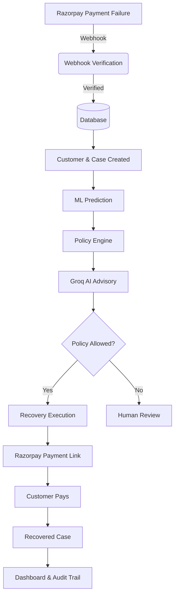

# Razorpay RecoverAI — Beginner's Guide

Welcome to the Razorpay RecoverAI project! This comprehensive guide is designed for beginners, developers, and hackathon judges to understand the entire project from start to finish.

## Table of Contents

1. [What is RecoverAI?](#1-what-is-recoverai)
2. [The Business Problem](#2-the-business-problem)
3. [Architecture Overview](#3-architecture-overview)
4. [The End-to-End Flow](#4-the-end-to-end-flow)
5. [Core Components](#5-core-components)
6. [Dashboard & Demo Mode](#6-dashboard--demo-mode)
7. [Important Project Files](#7-important-project-files)
8. [Local Setup & Commands](#8-local-setup--commands)
9. [Hackathon Pitch Guide](#9-hackathon-pitch-guide)
10. [Troubleshooting & Common Errors](#10-troubleshooting--common-errors)

---

## 1. What is RecoverAI?

**RecoverAI** is an intelligent, automated revenue recovery engine built on top of Razorpay. When a customer's payment fails, RecoverAI automatically catches the failure, analyzes it using Machine Learning (ML), applies strict business rules (Policy), generates personalized recovery strategies using Generative AI (Groq), and automatically sends a Razorpay Payment Link to recover the lost revenue.

## 2. The Business Problem

**Why payment recovery matters:**
In SaaS and e-commerce, failed payments (due to insufficient funds, expired cards, or network timeouts) cause significant "involuntary churn"—where customers want to pay but fail due to technical or banking reasons. Recovering even a fraction of this revenue directly boosts the bottom line without acquiring new customers. 

## 3. Architecture Overview

### Frontend Architecture
A modern Single Page Application (SPA) built with **React**, **TypeScript**, and **Vite**. 
- **Styling:** Premium fintech aesthetic using pure, token-based CSS variables (no bloated CSS frameworks).
- **Visualization:** `recharts` for rendering lightweight, interactive analytics.
- **Role:** Displays the live recovery queue, audit trails, charts, and allows human intervention.

### Backend Architecture
Built with **Python 3.13** and **FastAPI**.
- **Role:** Handles webhooks, database interactions, ML predictions, Policy checks, AI advice, and recovery execution. 
- **Design:** Modular service-based architecture (e.g., `audit_service`, `recovery_service`).

### Database Architecture
**SQLite** managed by **SQLAlchemy (ORM)**.
- **Customers:** Tracks lifetime value and historical success/failure rates.
- **Payment Cases:** Tracks individual failed transactions, amounts, reasons, and recovery status.
- **Audit Events:** An append-only ledger providing a chronological history of every system decision.

---

## 4. The End-to-End Flow

Here is the complete journey of a failed payment:



---

## 5. Core Components

### Razorpay Webhook Flow
**INPUT:** `payment.failed` event from Razorpay.
**PROCESS:** The backend mathematically verifies the `X-Razorpay-Signature` header against the `RAZORPAY_WEBHOOK_SECRET` to prevent spoofing.
**OUTPUT:** A verified payload ready for processing.

### Customer Creation/Lookup
When a failure occurs, the system looks up the `razorpay_customer_id`. If it doesn't exist, it creates a new Customer record to track their lifetime value and payment history.

### Recovery Case Creation
A new `PaymentCase` is created with a `FAILED` status, capturing the exact amount and failure reason.

### ML Prediction
**INPUT:** Customer history, amount, failure reason.
**PROCESS:** A pre-trained `scikit-learn` Random Forest model predicts the likelihood of recovery (e.g., 85%).
**OUTPUT:** A recovery probability score.

### Policy Engine (Authoritative)
**INPUT:** Case data.
**PROCESS:** Applies strict business rules (e.g., "Do not auto-recover amounts over ₹5,000,000").
**OUTPUT:** A definitive `Allowed` or `Blocked` decision. **Policy is the final word.**

### Groq AI Advisory Layer (Advisory)
**INPUT:** Failure context, customer history, policy decision.
**PROCESS:** LLM (Llama 3) generates personalized reasoning and drafts a polite email message to the customer.
**OUTPUT:** Actionable recommendation and messaging. 
*Note: AI is advisory; it can suggest actions, but it cannot override the Policy Engine.*

### Recovery Execution
**INPUT:** Approved case.
**PROCESS:** The backend makes an API call to Razorpay to generate a Payment Link.
**OUTPUT:** Payment link URL is saved to the case, and status shifts to `RECOVERING`.

### Customer Payment Success / Recovery
When the customer pays the link, Razorpay sends a `payment_link.paid` webhook. The system catches this, marks the case as `RECOVERED`, and stops any further retries.

### Audit Trail
Every single action (Webhook received, ML scored, Policy blocked, AI advised, Link created) generates an immutable `AuditEvent`. This ensures compliance and transparency.

### Security Mechanisms
- **Webhook Verification:** Cryptographic HMAC SHA256 checks.
- **State Protection:** `RECOVERING` cases cannot be re-analyzed or accidentally executed again. `CLOSED` cases are locked.
- **Idempotency:** Webhooks are processed safely; duplicate Razorpay events won't double-process cases.
- **Failure Fallbacks:** If the Groq AI API fails or times out, the system automatically degrades gracefully to a deterministic fallback advisor, ensuring operations never halt.

---

## 6. Dashboard & Demo Mode

### Dashboard Statistics
The dashboard visualizes:
1. **Revenue at Risk:** The total INR value of failed transactions.
2. **Revenue Recovered:** The INR value of successfully recovered transactions.
3. **Recovery Rate:** The percentage of recovered volume.

### Demo Mode & Demo Data Seeder
Because testing failed payments requires real bank accounts in production, we built a safe **Demo Environment**.
- **DEMO_MODE=True** allows judges and users to click a "Reset Demo Data" button.
- **What it does:** Safely wipes the database and uses `app/services/demo_service.py` to generate synthetic recovery cases (Failed, Recovering, Recovered, Human Review, Closed).
- **Security:** It does **NOT** make actual Razorpay or Groq API calls during seeding, saving API credits and ensuring safety. The API immediately rejects requests if `DEMO_MODE` is disabled.

### What happens when the user clicks...
- **Analyze:** Frontend sends a POST request. Backend runs ML, Policy, and AI, then saves the explanation. UI updates with the triad of decisions.
- **Execute:** Frontend sends a POST request. Backend confirms Policy allows it, creates a Razorpay Payment Link, logs an audit event, and updates status to `RECOVERING`.

---

## 7. Important Project Files

- **`backend/app/api/webhooks.py`**: Receives and verifies Razorpay events.
- **`backend/app/services/recovery_service.py`**: The brain of the operation. Orchestrates ML, Policy, and AI.
- **`backend/app/ml/train.py` & `predict.py`**: Handles synthetic training and realtime prediction.
- **`backend/app/api/demo.py`**: Safely manages the Demo Mode reset functionality via the UI.
- **`backend/app/services/demo_service.py`**: The actual script that builds the synthetic database payload.
- **`frontend/src/App.tsx`**: The main React application managing the UI, charts, and API interactions.
- **`frontend/src/styles.css`**: The design system powering the premium fintech aesthetic.

---

## 8. Local Setup & Commands (Quick Reference)

### Important Environment Variables (`backend/.env`)
```env
RAZORPAY_KEY_ID="rzp_test_..."
RAZORPAY_KEY_SECRET="..."
RAZORPAY_WEBHOOK_SECRET="..."
GROQ_API_KEY="gsk_..."
DEMO_MODE="True"
```

### Important Commands

**Start the Backend:**
```bash
cd backend
source .venv/bin/activate
uvicorn app.main:app --reload --port 8000
```

**Start the Frontend:**
```bash
cd frontend
npm run dev
```

**Run Backend Tests:**
```bash
cd backend
pytest -q
```

**Build Frontend:**
```bash
cd frontend
npm run build
```

**Seed Demo Data via CLI:**
```bash
cd backend
PYTHONPATH=. python scripts/seed_demo.py --reset
```

### Important API Endpoints
- `POST /api/webhooks/razorpay`: Razorpay webhook entry point.
- `GET /api/cases`: Fetch recovery queue.
- `POST /api/cases/{id}/analyze`: Run ML/Policy/AI.
- `POST /api/cases/{id}/execute`: Create Razorpay payment link.
- `POST /api/demo/reset`: Wipe and seed demo data safely.

---

## 9. Hackathon Pitch Guide

### How to explain this to a judge (2 minutes)
1. **The Hook:** *"E-commerce businesses lose 10% of revenue to failed payments. We built RecoverAI to win it back."*
2. **The Product:** *"RecoverAI catches Razorpay failures instantly, uses ML to predict if we can recover it, and uses AI to draft the perfect message."*
3. **The Differentiator:** *"Unlike standard AI tools, we implemented a strict deterministic Policy Engine. AI is advisory, Policy is authoritative. It's safe for enterprise."*
4. **The Demo:** 
   - Click "Reset Demo Data" to load a fresh state.
   - Show the Analytics Dashboard (Revenue at risk vs recovered).
   - Select a `FAILED` case. Click **Analyze**. Show the judge how ML + Policy + AI generated a strategy.
   - Click **Execute**. Show the generated Razorpay Payment Link and the updated Audit Trail.

---

## 10. Troubleshooting & Common Errors

- **Webhook Signature Mismatch:** Ensure your `.env` `RAZORPAY_WEBHOOK_SECRET` exactly matches your Razorpay dashboard setting.
- **Groq AI Timeout / Rate Limit:** If Groq fails, the system safely falls back to a deterministic advisor. You will see this noted in the audit trail.
- **Demo Reset Disabled:** If the UI says Demo is disabled, ensure `DEMO_MODE="True"` is in your `backend/.env` file.
- **Frontend chunk size warning:** When running `npm run build`, you may see a warning about chunk size (>500kb). This is normal because we use `recharts` for visualization.
